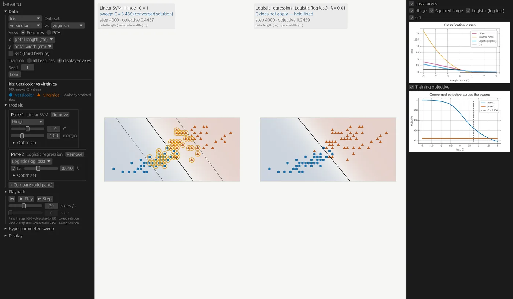
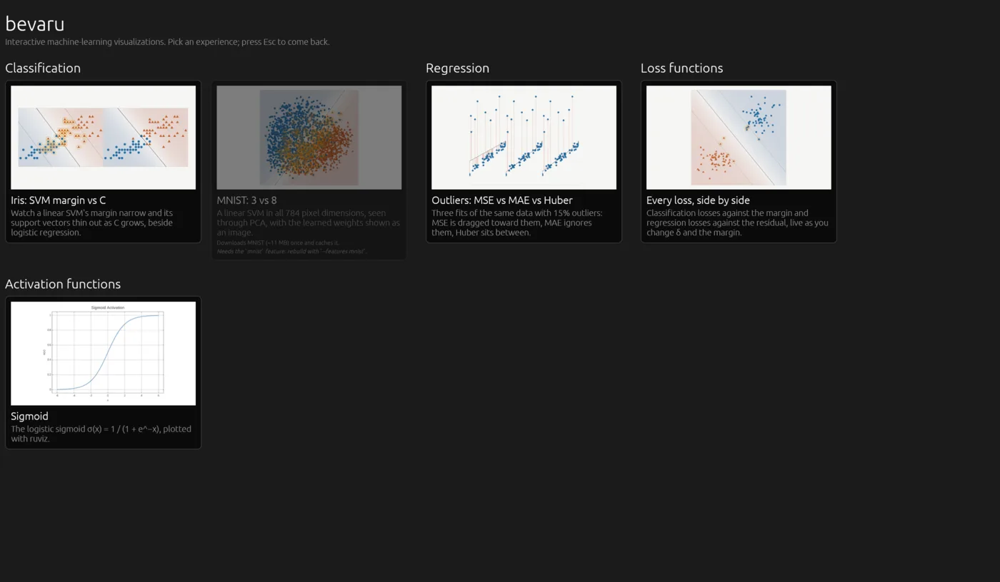
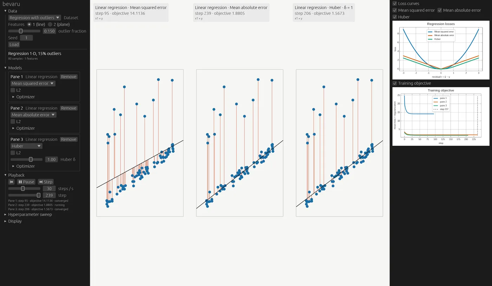
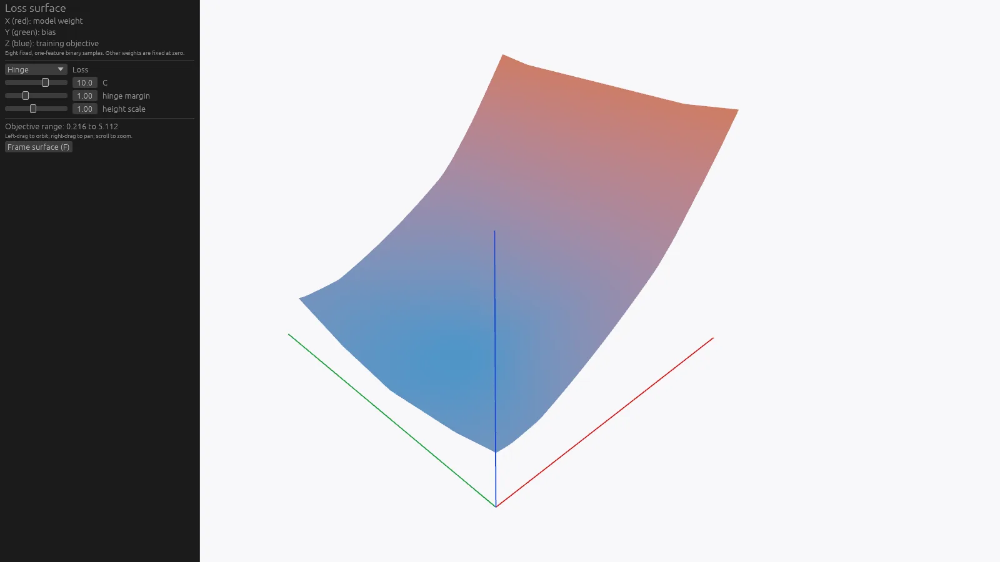
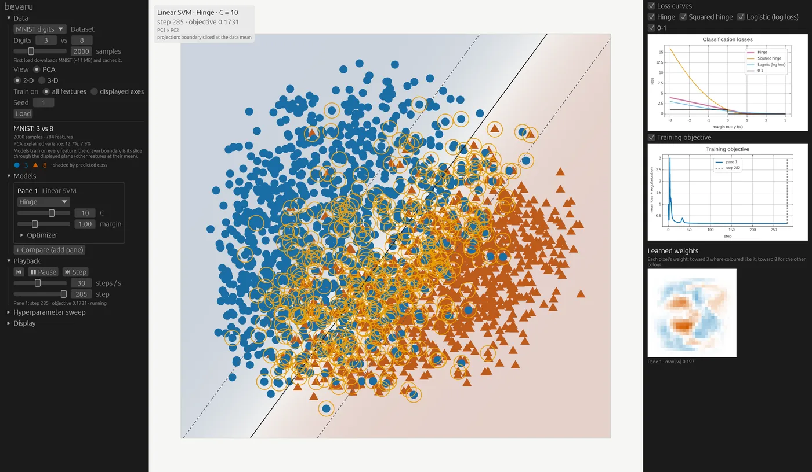
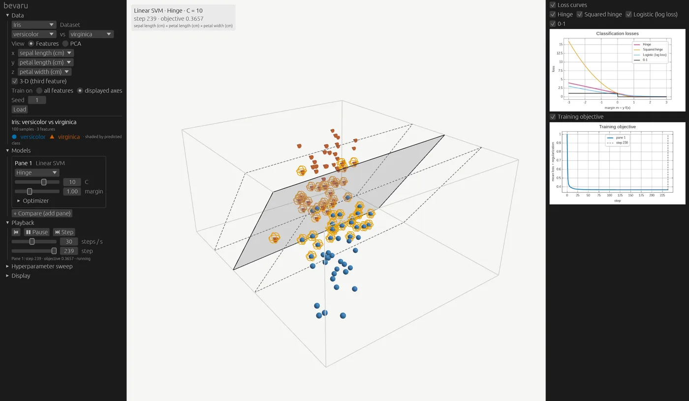

# bevaru

`bevaru` is a Bevy plugin for interactive, animated machine-learning visualizations, with charts drawn by [ruviz](https://github.com/Ameyanagi/ruviz).

The first subject is loss functions. You can watch how MSE, MAE, Huber, hinge, squared hinge, logistic and 0-1 loss, and their hyperparameters, move the fitted model:
- the decision line or plane,
- SVM margins and support vectors,
- regression fits and their residuals.

The data can be synthetic, Iris, or MNIST.



## Running it

### Prerequisites

- **Rust 1.95 or newer**, which Bevy 0.19 requires. Install it with [rustup](https://rustup.rs), or update an existing install with `rustup update`.
- **A GPU with current drivers.** Rendering goes through wgpu: Vulkan on Linux, Metal on macOS, DirectX 12 or Vulkan on Windows.
- **On Linux, a few system libraries:**

  ```sh
  # Debian / Ubuntu
  sudo apt-get install pkg-config libudev-dev libwayland-dev libxkbcommon-dev

  # Fedora
  sudo dnf install gcc pkgconf-pkg-config systemd-devel wayland-devel libxkbcommon-devel
  ```

  macOS and Windows need nothing beyond Rust. Note that this project is developed and tested on Linux only.

### Run

```sh
git clone https://github.com/buddha314/bevaru
cd bevaru
cargo run --release
```

The first build compiles Bevy and takes several minutes; after that it starts in seconds. Plain `cargo run` (a debug build) also works and builds faster, but animates less smoothly.

A window opens on the **lobby**:
1. Click a card to start that experience.
2. Press `Esc`, or click **◀ Lobby**, to come back.
3. Pick another.

### Other ways to start

| Command | What it does |
| ------- | ------------ |
| `cargo run --release -- --list` | List every experience id. |
| `cargo run --release -- <id>` | Open one experience directly, skipping the lobby (e.g. `iris-svm`). `Esc` still returns to the lobby. |
| `cargo run --release --features mnist` | Also enable the MNIST experience. Its first start downloads about 11 MB and caches it; set `BEVARU_MNIST_DIR` to use files you already have. |
| `cargo run --release --example iris_svm` | The examples open the same experiences directly. Also available: `regression_mse_vs_mae`, `loss_curves`, `mnist_svm` (needs `--features mnist`) and `ml_interactive` (the sigmoid). |
| `cargo run --release --example loss_surface` | Orbit a 3-D objective surface for hinge, squared hinge, or logistic binary cross-entropy; change C, margin, or L2 strength. |

### Troubleshooting

- **`cargo run` opens the Iris sweep instead of the lobby, or Cargo can't find an example:** your checkout predates the lobby. Run `git pull`.
- **The MNIST card is greyed out:** rebuild with `--features mnist`.
- **The Linux build fails mentioning `libudev`, `wayland` or `xkbcommon`:** install the system libraries above.
- **Vulkan validation errors in a debug build's log:** these come from the graphics driver's swapchain handling and don't affect rendering. Release builds don't log them.

## The lobby

`cargo run` opens a lobby with one card per experience, grouped by category. Pick one to start it. **◀ Lobby** or `Esc` brings you back, and leaving cleans up everything the experience created.



Every experience, and how to open it directly:

| Experience | Open directly | Shows |
| ---------- | ------------- | ----- |
| Iris: SVM margin vs C | `cargo run --release -- iris-svm` | Versicolor vs virginica. A linear SVM's margin narrows and its support vectors thin out as C sweeps from 0.01 to 100. Logistic regression sits beside it as a reference. |
| MNIST: 3 vs 8 | `cargo run --release --features mnist -- mnist-svm` | 3 vs 8 in all 784 pixels. The scene shows the PCA view; a 28 × 28 image shows the weights the model learned. Without the `mnist` feature, the card is shown disabled. |
| Outliers: MSE vs MAE vs Huber | `cargo run --release -- regression-mse-vs-mae` | 15% outliers. MSE is dragged toward them, MAE ignores them, and Huber lands in between depending on δ. |
| Every loss, side by side | `cargo run --release -- loss-curves` | Every loss plotted against margin or residual. Edit δ and the hinge margin live while an SVM trains. |
| Sigmoid | `cargo run --release -- sigmoid` | The original scaffold: a ruviz sigmoid plot shown as a sprite. |



**In the app:**
- **Control panel (left):** pick the data, view, losses and hyperparameters. Add up to three side-by-side panes, play, pause, step or scrub training, and run hyperparameter sweeps.
- **Chart panel (right):** loss curves, the training objective, and learned weights.
- **Mouse:** in 2D, drag to pan and scroll to zoom. In 3D, left-drag to orbit and right-drag to pan.
- **Keys:** `Space` play/pause · `S` step · `R` reset · `F` frame data · `Esc` back to the lobby.

## Visual verification walkthrough

Run each experience from the repository root. The first build may take a few minutes.

1. **Iris SVM and C sweep:** Run `cargo run --release -- iris-svm`. The automatic sweep moves `C` from 0.01 to 100: the SVM boundary and dashed margins should move, support vectors should have gold rings, and the logistic-regression pane should stay fixed. During the sweep, click **+ Compare (add pane)**; three panes should appear and the sweep should stop without a crash. Drag the `C` slider, switch **Hinge** to **Squared hinge**, and press **Play** to watch training continue.
2. **Regression with outliers:** Run `cargo run --release -- regression-mse-vs-mae`. MSE should lean toward the high outliers, MAE should stay nearer the main trend, and Huber should lie between. Drag **Huber δ** to update its fit and loss curve. In **Display**, toggle **Residuals** and check that the vertical segments appear and disappear.
3. **Loss curves and playback:** Run `cargo run --release -- loss-curves`. Both classification and regression loss charts should show their legends. Drag the **margin** slider in **Models** and watch the hinge curve change. Press `Space` to pause or play, `S` to step, and `R` to reset. Scrub the step slider backward; the boundary and training-chart marker should follow the selected step.
4. **MNIST:** Run `cargo run --release --features mnist -- mnist-svm`. The first run downloads and verifies MNIST; `BEVARU_MNIST_DIR` can point to a folder with the four original `*-ubyte.gz` files instead. The 3-vs-8 scene should label its PCA boundary as a **projection**, and the right panel should show a 28 × 28 weight image.

5. **Lobby round trip:** Run `cargo run --release`. Open each card, press `Esc`, and check that the lobby comes back with nothing left over from the experience. Do the same with the **◀ Lobby** button. Open **Sigmoid** and go straight back; then open an experiment. Each should start clean.

For a 3-D camera check, run Iris, select **3-D (third feature)**, and click **Load**. Left-drag to orbit, right-drag to pan, and scroll to zoom. Press `F` or click **Frame data** to fit every point in view again. Switch back to 2-D to check **Decision regions**; toggle **SVM margins** in either view.

For the parameterized loss asset, run `cargo run --release --example loss_surface`. Its red X axis is one model weight, green Y is the bias, and blue Z is the training objective (mean loss plus L2 regularization) for eight fixed binary samples. Select **Hinge**, **Squared hinge**, or **Logistic (binary cross-entropy)** in the panel. Change **C** and **hinge margin** for SVM losses or **L2 λ** for logistic loss; the surface and its objective range should update. Left-drag to orbit, right-drag to pan, scroll to zoom, and press `F` to frame it again.



To save a screenshot automatically and exit after eight seconds, for example:

```sh
BEVARU_SCREENSHOT=iris.png BEVARU_SCREENSHOT_AFTER=8 cargo run --release -- iris-svm
```



## For agents

bevaru is built to be used by AI agents writing applications:
- **[`llms.txt`](llms.txt):** the index of docs written for agents. Start there.
- **[`docs/agents/capabilities.md`](docs/agents/capabilities.md) and [`.json`](docs/agents/capabilities.json):** every loss, model, dataset, sweep parameter, experience and control message, with ids, valid ranges and JSON Schemas. They're generated from the code (`cargo run -p bevaru-mcp -- gen-docs`), and a test fails if they fall out of date.
- **[`AGENTS.md`](AGENTS.md):** instructions for coding agents working on bevaru itself.

- **[`bevaru-mcp`](docs/agents/mcp.md):** an MCP server, so agents can evaluate losses, train and sweep models, and render charts without writing code. Install it with `cargo install --git https://github.com/buddha314/bevaru bevaru-mcp`, then add it to your MCP client (`claude mcp add bevaru -- bevaru-mcp`).

- **Driving a running window:** start the app with `cargo run --features remote -- --remote`, and agents can open experiences, control playback and sweeps, and read the state, through `bevaru-mcp --app` or plain JSON-RPC. See [the recipe](docs/agents/recipes/drive-a-running-app.md).

## Use it in your own app

```toml
[dependencies]
bevaru = { git = "https://github.com/buddha314/bevaru" }
```

```rust
use bevaru::core::TrainerConfig;
use bevaru::{BevaruPlugin, DatasetChoice, ExperimentSpec, StartupExperiment};
use bevy::prelude::*;

fn main() {
    let spec = ExperimentSpec::new(
        DatasetChoice::Iris { positive: "versicolor".into(), negative: Some("virginica".into()) },
        TrainerConfig::svm(1.0).unwrap(),
    )
    .compare(TrainerConfig::logistic());

    App::new()
        .add_plugins(DefaultPlugins)
        .insert_resource(StartupExperiment(spec))
        .add_plugins(BevaruPlugin) // after DefaultPlugins
        .run();
}
```

**Driving it from code:**
- Send `PlaybackCommand` (`Play`, `Step`, `Seek(n)`, …) to control training playback.
- Send `SweepCommand::Start(SweepSpec { .. })` to run a hyperparameter sweep.
- Send `LoadExperiment(spec)` to switch to new data.

For the lobby in your own app, add `LobbyPlugin` (or `LobbyPlugin::starting_with("id")`). `bevaru::app::windowed_app` builds the same app the `bevaru` binary uses.

`BevaruPlugin` adapts to the app it's added to:
- **After `DefaultPlugins`:** it adds the scene, charts and egui control panel.
- **After `MinimalPlugins`:** it runs headless — experiments, training and sweeps work with nothing rendered.

### Adding an experience

Experiences live in a registry. Register one, and it appears in the lobby, works with `cargo run -- <id>`, and gets the same clean-up as the built-ins. There are two kinds:

- **Experiment:** a dataset and models in the standard scene, charts and controls.

  ```rust
  use bevaru::experiences::{Experience, ExperienceKind, OnLoaded, RegisterExperience, Requirement};

  app.register_experience(Experience {
      id: "iris-logistic",                 // kebab-case, unique
      title: "Iris: logistic regression",
      summary: "One sentence on what it teaches.",
      category: "Classification",         // lobby heading
      thumbnail: None,                    // or Thumbnail::Embedded(include_bytes!(..))
      requires: Requirement::None,
      note: None,
      kind: ExperienceKind::Experiment {
          spec: || ExperimentSpec::new(/* dataset */, TrainerConfig::logistic()),
          on_loaded: vec![OnLoaded::Play],
      },
  });
  ```

- **Custom:** anything else (the sigmoid plot is one). Your plugin brings the systems:
  - gate them with `run_if(in_experience("my-id"))`;
  - set up in an observer of `ExperienceStarted`, and remove your resources in one of `ExperienceStopped`;
  - mark every entity you spawn with `ExperienceEntity`; they're despawned automatically when the experience stops.

  See `src/experiences/sigmoid.rs`.

**Thumbnails:** run `scripts/thumbnails.sh [id …]`, which needs a display and a GPU. It opens each experience, captures its scene with overlays hidden, trims the background, and writes a 480 × 270 PNG to `assets/thumbnails/<id>.png`. Built-in thumbnails are embedded in the binary, so the lobby works from any directory. An experience without one gets a placeholder.

**Clean-up:** leaving an experience, however it happens, returns the app to its lobby state. That covers the Back button, `Esc`, a failed load, switching experiences, and quitting. A headless test enters and leaves every experience ten times and checks that entities, meshes, materials, images and background tasks don't grow. If you add a custom experience, run it: `cargo test -p bevaru lobby`.

## Layout

| Crate | Contents |
| ----- | -------- |
| `crates/bevaru-core` | Everything without Bevy: losses with their gradients, linear models trained one step at a time (with step history), datasets, and PCA. |
| `bevaru` (root) | The Bevy plugin: scene, ruviz charts, playback and sweeps, the egui controls, the experience registry and the lobby. Also the `bevaru` binary (`src/main.rs`). |



## MNIST

MNIST is optional, behind the `mnist` cargo feature.
- **Download and checks:** on first use it downloads about 11 MB, checks each file against fixed SHA-256 checksums, and caches it in your user cache directory.
- **Existing copy:** set `BEVARU_MNIST_DIR` to a folder containing the four original `*-ubyte.gz` files to use them instead.
- **Real-data test:** this test is skipped by default because it needs the data.

  ```sh
  cargo test -p bevaru-core --features mnist --release -- --ignored
  ```

## Datasets and credits

- **Iris:** Fisher's Iris data (R. A. Fisher, 1936), public domain. The bundled copy is scikit-learn's, which fixes two errors in the UCI file.
- **MNIST:** Y. LeCun, C. Cortes and C. J. C. Burges, *The MNIST database of handwritten digits*.
- **Colours:** the Okabe–Ito palette, which stays distinguishable with common colour-vision deficiencies.
